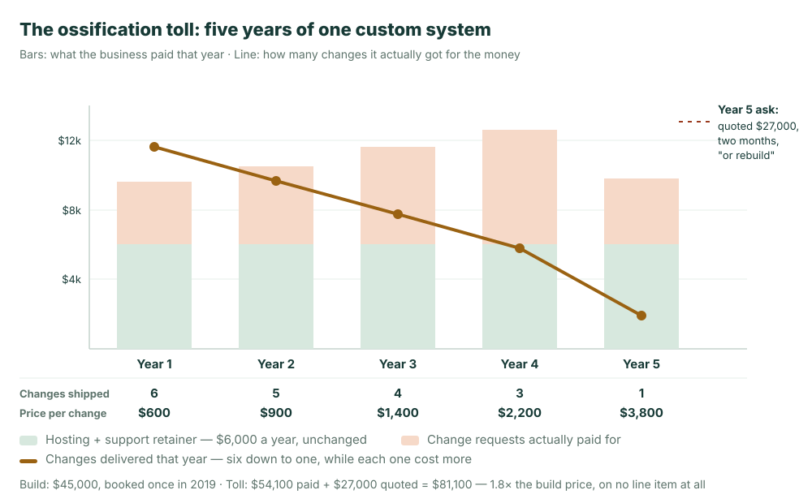

**The short version:** A custom internal system rarely breaks. It ossifies, and the expensive part starts after the build invoice is paid. In the five-year ledger below, one $45,000 system went on to collect $81,100 in what this article calls **the ossification toll**: a retainer, change requests priced as risk, and finally a $27,000 quote to move one step forward. That is 1.8x the purchase price, on no line item anyone ever approved.

Here is the email that usually starts this conversation. A distributor asks its development shop for the two things the business needs this year: dealer tiers, and one report finance has been assembling by hand. The reply comes back:

> Rework: $27,000. Timeline: two months. Honestly, parts of it are coupled deeply enough that we would recommend rebuilding.

Nothing is broken. The system runs. It has run every day since 2019, when it cost $45,000 and was, for about six months, the best thing that had happened to the company's operations.

## What You Actually Bought

You did not buy an order system. You bought **one company's rules as they stood in 2019, transcribed into code by people who no longer work on it.**

That distinction is invisible on delivery day and decisive five years later. The rules are still in there: which orders need a second approval, how a credit hold releases, which customers get which price. They are simply not written anywhere a person can read. They exist as conditionals spread across files, and the only complete copy ever assembled lived in one engineer's head. That engineer left in 2021. The shop that employed him has since rotated through three other clients' codebases.

So what you own is a working system with no readable statement of what it does. Not a badly built one. A normally built one. This is what hand-built custom software is.

## The Ossification Toll

Most owners can quote the build price from memory. Almost none can quote the second number, because it was never a number. It was five years of small invoices filed under different budgets.

Here is that ledger for the distributor, one composite case with the arithmetic laid out so you can run it against your own:

| Line | 2019–2024 | Where it showed up |
| --- | --- | --- |
| The build | $45,000 | A capital line called "the order system" |
| Hosting + support retainer | $30,000 | IT operations, $500 a month, never questioned |
| Change requests actually paid for | $24,100 | 19 changes, spread across four department budgets |
| The quote to move one step forward | $27,000 | Not yet approved. This is the email above |
| **Toll after the build invoice** | **$81,100** | **Nowhere, as a single figure** |

**$81,100 against a $45,000 build: 1.8x the purchase price.** That is the ossification toll. Everything a system collects from you after it loses the ability to change, none of it arriving labelled as the cost of that system.

The revealing column, though, is not the money. It is what the money bought.



Year one bought six changes at roughly $600 each. Year five bought one, at $3,800. Spending held flat to rising while delivery collapsed. The business did not need less. It **asked** for less, and that decision appears in no ledger anywhere.

One thing is deliberately missing from the table: waiting. Between "we need dealer tiers" and any version of dealer tiers existing, people ran the tiers in a spreadsheet, keyed the results back in, and caught the mismatches by hand. Nobody invoices for that, so this article will not pretend to price it. Just note that every figure above is a floor.

## Why the Price Rose When the Work Did Not

The $600 change and the $3,800 change were, in engineering terms, about the same size. So why did the price rise six-fold?

Because you are not buying the work. You are buying a promise, and the promise became harder to make.

A quote against a system nobody can read has to cover two things: doing the work, and being wrong about what else the work touches. In year one the second part was close to zero, because the author was still there and could tell you in one sentence what else read the credit-hold logic. By year five nobody could say. So the shop does the rational thing and pads the number. That padding is not a markup on difficulty. It is **insurance the vendor is buying, at your expense, against a question that no longer has an answer.**

It is also why "we would recommend rebuilding" is often not a sales tactic. A rebuild is something the shop can bound and price. A change is an unbounded risk they are being asked to underwrite. When those are the only two options on the table, recommending the rebuild is the honest answer, which tells you how far the options have already narrowed.

## The Objection: "Maybe We Just Hired the Wrong Shop"

Take the objection seriously, because it is sometimes right. Some shops genuinely do ship untested work and leave nothing behind. Hire better and your system ossifies more slowly.

More slowly, though, not never. A stronger team delivers the same **kind** of artifact: business rules expressed as implementation, legible only to someone who has read all of it. It lasts longer and the handover notes are better, and it still ends with the rules living in code and the authors living elsewhere. The failure is in the shape of what gets delivered, not in the skill of whoever delivers it.

If your reaction is that this is a pre-AI problem, that today an agent writes the whole thing in an afternoon and none of it applies, the shape survives the change of author. It just arrives sooner. [Vibe coding technical debt](/en/blog/vibe-coding-technical-debt-2026/) is that story: an AI-built expense system nobody dared touch by month seven, and why an AI author leaves behind a worse version of the same gap, since there was never a person to go back and ask. **That piece is the accelerated case. This one is where the pattern comes from.** If you are running a hand-built system from 2019, start here. If you are about to have an agent generate its replacement, read that one before you do.

## A Six-Question Health Check

Not "is the code any good." You cannot answer that and it is not your job. These are six things an owner can observe without opening a single file. Score one point each.

1. **The authors are gone.** Whoever wrote it no longer works on it. The shop moved on, the engineer left, or both.
2. **Small changes come back as schedules.** One field, one status, one approval step is quoted in weeks rather than treated as a task.
3. **The same size of change costs more than it used to.** Not because the requests got bigger.
4. **Your documentation is a person.** To learn why a rule works the way it does you ask someone, and if they are away, you wait.
5. **You have started routing around it.** A spreadsheet, a manual re-key, a second tool quietly holding the real answer. Nobody decided to do this. It accumulated.
6. **Every new idea gets answered with "we would have to rebuild first."** Connecting a new tool, adding AI, opening a customer portal: the first sentence back is about the system, not about the idea.

**Three or more, and the system has stopped growing.** It still runs and it will keep running, and from here every plan you make has to route around it, which is question five arriving on schedule.

**Five or more, and it is your most expensive holding, with a toll larger than the retainer suggests.** The retainer is the part you can see. The change requests, the waiting, and the ideas nobody bothered to raise because everyone already knew the answer are the rest of it.

Question five is the one owners most often score without noticing. Ossification does not announce itself as a failure. It shows up as a workaround everybody agreed to and nobody proposed.

## What Actually Changes the Shape

None of this is fixed by finding better developers, and a rewrite does not fix it either. A rewrite buys a new system with the same shape and resets the clock to year one. What changes the outcome is changing what gets written down.

The rules a business runs on, which objects exist, what fields they carry, who may see and change them, what needs approving and by whom, can be stated as **declarations a person can read** instead of being distributed through an implementation as conditionals. "Orders above $100,000 need the regional director's approval" is either one sentence in one place, or it is a condition in four files. The first version survives its author. The second is what the distributor owns.

That is what ObjectStack is for: business objects, permissions, processes and actions as reviewable definitions, executed by an open runtime, so the definition **is** the system rather than a description that drifts from it. Because those definitions are stated in the open rather than locked inside one vendor's product, they amount to an **[open business ontology](/en/glossary/ontology/)**, and the rules outlive the shop that set them up. That is precisely the failure this article is about.

The AI part follows from that, and it runs in the opposite direction to the usual pitch. The value is not that an agent can write your system quickly. The distributor's shop wrote its system quickly too, and that is how it got here. The value is that when the definition is small and declarative, an agent proposes a change as a diff and **the accountable person can read it**: field, permission, approval step, all on one screen. That is the honest form of [metadata-driven development](/en/glossary/metadata-driven-development/), where the AI writes the definition rather than the implementation and a human still signs off on something small enough to genuinely review.

## And No, This Does Not Mean Starting Over

The most practical route is also the least dramatic: leave the old system running and state a readable layer above it. The data stays put, the 2019 system keeps taking orders, and the objects, permissions and processes get declared on top where a person and an agent can both read them. [Connecting an existing database without migrating](/en/blog/extend-existing-systems-with-ai/) covers the mechanics. For plants running an ERP and an MES that will not be replaced this decade, [the manufacturing version](/en/blog/manufacturing-legacy-systems-ai/) picks the two entry points worth starting with.

## What This Does Not Fix

Declarations cover the part of enterprise software that repeats: objects, fields, relationships, views, permissions, approvals, processes. That is most of an order system and most of an expense system. It is not everything. Genuinely novel logic, a pricing algorithm that is your actual competitive edge or a real-time engine, is code, should be code, and gets worse if you force it into declarations.

Choosing a runtime is also a real dependency, and worth stating plainly: you are trusting someone else's implementation of the parts you no longer write. The reason it is still the better trade is that a runtime is versioned, migratable, and audited by everyone who uses it, while the thing you hold today is one shop's 2019 implementation that nobody has read since.

And the toll already paid is sunk. Nothing here recovers the $81,100. What this decides is whether the replacement, whenever it arrives and by whatever route, has the same shape or a different one.

## The Question to Ask in Year One

Software is shifting from something you buy once into something that has to keep changing, and the systems that survive the shift are the ones whose rules stay legible to whoever comes next: the new hire, the new vendor, the agent. The distributor's system was not badly built. It was built in a shape that could not be handed over, and the toll was the price of that shape.

So before the next custom build, or before pointing an agent at the problem, ask the question the distributor only got to ask in year five: **when this needs to change and the people who made it are gone, who reads it?**

If the answer has to be "anyone, including an agent," have your coding agent state one rule you already run on, the approval threshold is a good first one, as a definition rather than as code:

```bash
npm i -g @objectstack/cli && os start
```

Then hand what comes back to someone who has never seen your system, and ask them what it does. That question is the entire test, and it is the one the 2019 build was never going to pass.
