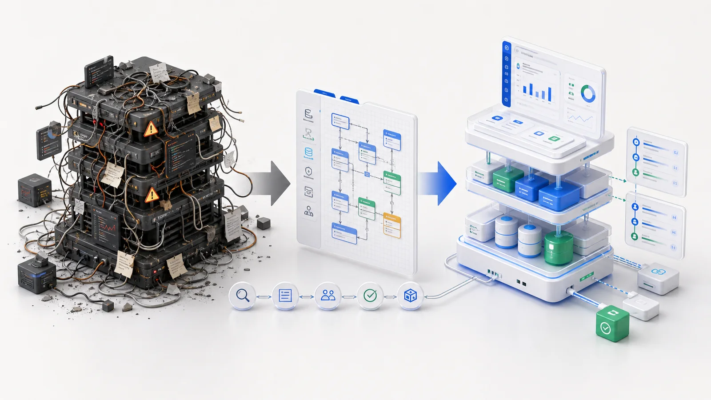

---
# @generated zh-Hant from zh-Hans (s2twp) — edit the zh-Hans file; delete this line to hand-maintain.
title: 你花幾十萬做的內部系統，為什麼半年後就沒人敢動了？
description: 定製系統不是越用越順，而是越用越僵——直到沒人敢碰。這背後是一筆很多老闆沒算過的賬，和一個 AI 時代會被放大十倍的根因。
author: ObjectStack Team
date: 2026-06-02
status: draft
topic: modernization
audience: business
cover: ./cover.jpg
tags:
  - AI落地
  - 數字化轉型
  - 趨勢觀點
---

先說個扎心的事實：很多公司花大價錢定製的內部系統，真正"好用"的時間，往往只有半年。

不是它壞了，是**沒人敢動了**。

加個欄位、改個審批、對接個新工具——你一開口，技術那邊就皺眉："這個改起來有點麻煩。" 報個價、排個期，一來二去你也懶得提了。系統就這麼定格在了第一版，像一棟蓋好就再也不許動的房子，你住在裡面，卻連掛幅畫都要先打報告。

這篇文章想說清三件事：系統是怎麼一步步僵死的、這背後你沒算過的一筆賬、以及為什麼在 AI 時代，這個老問題會被放大十倍。

## 一個你大機率似曾相識的場景

某家做貿易的公司，2019 年花了三十多萬，定製了一套訂單管理系統。上線那陣子老闆很滿意：下單、對賬、庫存聯動，比 Excel 強太多了。

五年過去，業務變了：多了幾條產品線，加了經銷商分級，財務想要一個新口徑的報表。老闆找回當年那家外包，對方報價：改造 18 萬，工期兩個月，"而且有些地方耦合太深，建議乾脆重做。"

老闆懵了。**當年三十多萬買的東西，現在想往前挪一步，要再花一半的錢、等兩個月，還被勸重做。** 更要命的是，當初寫這套系統的那個工程師，早就離職了，沒人說得清裡面到底是怎麼轉的。

這不是個例。我們見過太多這樣的公司——區別只是金額和行業。

## 系統是怎麼一步步"僵死"的

幾乎每套定製系統，都會走完這四步：

**第一階段：上線，真香。** 流程跑通，老闆滿意，團隊省事。這是蜜月期，通常持續不到半年。

**第二階段：開始打補丁。** 業務在變，需求不斷來。這裡加個判斷、那裡塞個特例，系統裡慢慢長出一堆"只有當時那個人知道為什麼"的邏輯。每個補丁單看都合理，疊在一起就成了一團亂麻。

**第三階段：那個人走了。** 外包結項、員工離職、技術換崗。程式碼還在硬碟上，但**真正的那套規則，是裝在他腦子裡的，他一走就帶走了。** 留下的註釋和文件，永遠停留在三年前的版本。

**第四階段：沒人敢動。** 新來的人接手，改一個地方，不知道會牽連哪三個地方，越改越虛。最後大家達成默契：能不動就不動。於是系統從"資產"徹底變成了"負債"——你離不開它，又升級不動它，每年還得為它的伺服器和維護持續付錢。

## 算一筆很多老闆沒算過的賬

大多數老闆只記得第一筆：定製花了多少錢。但一套僵死的系統，真正貴在後面那些沒記進賬本的地方：

- **改動成本越來越高**：第一年加個功能也許幾千塊，第三年同樣的改動報價翻幾倍——不是變難了，是沒人敢保證不出事，於是把風險打進了報價。
- **等待的代價**：一個本該當天上線的小調整，排期兩週。這兩週裡，業務在用變通辦法、人工補差錯，這些時間沒人計入系統成本，但它實實在在地燒錢。
- **繫結一個人的風險**：整套系統只有一個人能改，這個人就成了公司的"單點故障"。他要離職、要加薪、要請假，你都得看系統的臉色。
- **錯過的機會**：競爭對手三天能上線的新玩法，你因為"系統改不動"要兩個月——有些視窗，錯過就沒了。這筆賬最大，也最隱形。

把這些加起來你會發現：**定製系統真正的成本，不是你付出去的那幾十萬，而是它僵死之後，每一年都在悄悄收的"過路費"。**

## 根因不在程式設計師，在系統的"形態"

你可能會想：是不是當初找的人不行？換個更牛的團隊就好了？

大機率一樣。因為問題不出在某個人的水平，而出在傳統系統天生的**形態**：

它的本質，是**一大堆只有寫的人才看得懂的程式碼**，業務規則深埋其中。這種形態決定了三件事必然發生——

- **難傳承**：規則藏在程式碼裡，等於把公司的業務知識"私有化"進了某個工程師的大腦。人走了，知識就斷了。
- **難修改**：沒有人能一眼看清全貌，改動就成了拆違章建築，拆哪根柱子都心驚膽戰。
- **難被理解**：不只是人難懂，任何後來者——包括 AI——接手時都一樣懵。

記住這第三點，因為它正是接下來這場變化的關鍵。

## AI 時代，這個老問題會被放大十倍

現在每個老闆都想給業務加上 AI。於是你回頭看自己這套系統，想接個 AI 進去幫忙——

結果發現：**AI 也讀不懂它。**

那一團纏在一起的程式碼，AI 接手時和一個剛入職的程式設計師一樣，看不懂、不敢動。所以很多公司的 AI 專案，最後都卡在同一句話上："你這個系統，得先重做。"

這就引出一個殘酷但越來越真實的判斷：

> 未來 AI 能不能幫到你，很大程度上取決於一件事——**你的系統，它讀不讀得懂。**

讀得懂的公司，AI 能進來幫著改流程、查資料、做決策，越用越強；讀不懂的公司，AI 紅利和你基本無關，你只能在外圍買幾個聊天工具,自我安慰。同樣的行業、同樣的預算，兩類公司會就此分道揚鑣。

## 解法：把系統從"一堆程式碼"變成"一份說明書"

那有沒有別的活法？有。關鍵只有一句話：

**別再把業務規則埋進程式碼裡，而是把它寫成一份人和 AI 都能讀懂的、清清楚楚的"說明書"。**

聽起來抽象，但落到日常，差別是肉眼可見的：

- **過去**：想知道"超過 10 萬的訂單要誰審批"，得讓工程師翻程式碼、半天給你答覆。
- **現在**：這條規則就明明白白寫在一處，業務的人能看懂，新來的人能接手，AI 也能讀到——於是它能直接幫你改。

當系統是這種形態時，前面那三個"死結"會逐一鬆開：

- **換誰接手都看得懂**，不再繫結某一個程式設計師，外包跑了也不慌；
- **改一處不用動全身**，加欄位、調流程是分鐘級的事，不必排期兩週、提心吊膽；
- **AI 真的能幫你幹活**——因為它讀得懂整套系統，所以能幫你改、幫你維護，甚至自己動手把一個需求做完，而不只是個擺設的聊天框。

這正是我們做 ObjectStack 的出發點：把一整套業務系統，做成 AI 和人都能讀懂、能安全修改的結構。它緊湊到 AI 可以一次性"讀完"整個系統、理解每一處關聯，再幫你動手——這是傳統那種動輒幾十萬行程式碼的系統永遠做不到的。

憑什麼信？看一個最直觀的對比：過去你想加個新模組，要先找回原作者、排期、反覆測試，兩週起步；在這種新形態下，把需求說清楚，**當天就能改好**——很多時候，是 AI 自己把它改完、你只負責確認。

## "那是不是又要推翻重來？"——恰恰相反

聊到這，很多老闆的第一反應是："道理我懂，但我不可能把現在的系統全推翻重做。"

完全不需要。事實上，最務實的路，是**不動你的老系統，在它之上疊一層 AI 能讀懂的結構**——資料不搬家、原系統照常跑，卻能讓 AI 在上面工作，並且守住你原有的許可權和規矩。換句話說，你不是再賭一次"推倒重來"，而是給現有的家底，裝上一個能跟著 AI 一起進化的大腦。（這條路怎麼走，我們下一篇細講。）

## 給老闆的一張「系統健康自查表」

對照下面幾條，給自己的系統打個分（中一條記一分）：

- 加一個欄位，排期常常超過 3 天；
- 整套系統，只有 1 個人能改、改之前你會緊張；
- 想接 AI，被告知"得先重做"；
- 所謂的文件，其實就是"那個人的腦子"；
- 換過一次外包之後，舊系統幾乎直接報廢；
- 你已經記不清，每年為這套系統持續花了多少維護和改動的錢。

**3 分以上**，說明你的系統已經在"僵死"的路上——它還能跑，但已經停止生長。**5 分以上**，它大機率正在悄悄變成你最貴的那筆負債。

---

軟體正在從"做一次就定型的產品"，變成"會自己長大的資產"。這一輪 AI，真正在做的不是給你加個功能，而是在重新決定一件事：**哪些公司的系統能跟著 AI 一起進化，哪些會被永遠卡在原地。**

而這道分水嶺，比大多數人以為的，來得更快。

> 📋 想要完整版《內部系統健康自查清單（12 項）》+《老系統 0 遷移接 AI 可行性評估》？
> 在公眾號後臺回覆「**自查**」，或掃碼加我們，免費領取並約一次診斷。
